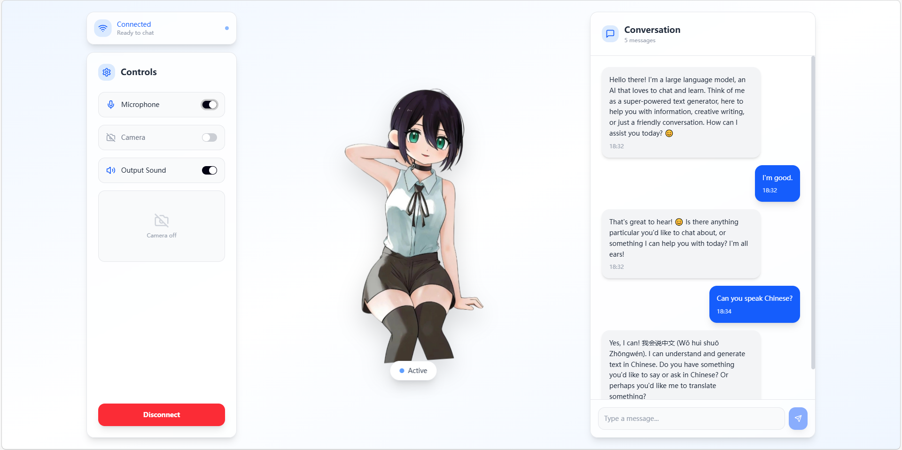

# 🎙️ Pipecat Voice Chat Agent

<div align="center">
  
</div>

A modern, real-time voice AI assistant built with **Pipecat**, **React**, and **WebRTC**. Experience ultra-low latency conversational AI with a beautiful, dynamic anime-style avatar interface.

## ✨ Features

- **🗣️ Real-time Voice Interaction:** Talk naturally with the AI using your microphone.
- **⚡ Ultra-low Latency WebRTC:** Smooth, uninterrupted communication powered by the `@pipecat-ai/small-webrtc-transport` package.
- **🎨 Modern React UI:** Beautiful, responsive interface built with Vite, Tailwind CSS, and Radix UI components. 
- **📜 Live Chat Transcription:** Scrollable conversation history so you never miss a word.
- **⚙️ Complete Device Controls:** Easily toggle your microphone, camera, and audio output directly from the side panel.
- **💃 Dynamic Avatar Presentation:** Engaging character display providing an immersive conversational experience.
- **🧠 Powerful AI Stack:** Fully integrated with Google Gemini (LLM), Deepgram Speech-to-Text (STT), and Cartesia Text-to-Speech (TTS).
- **🌐 Google Search Grounding:** The assistant can search the web for real-time information to accurately answer questions about current events, weather, and more.

---

## 🚀 Quickstart

Get your bot running locally in just a few minutes!

### 1. Prerequisites

- **Python 3.10+**
- **[uv](https://docs.astral.sh/uv/getting-started/installation/)** package manager
- **Node.js & npm** (for the frontend application)
- **API Keys** for Deepgram, Google Gemini, and Cartesia

### 2. Backend Setup

Clone the repository and set up your Python environment:

```bash
git clone https://github.com/mrhedoer/voice-agent.git
cd voice-agent

# Configure your API keys
cp env.example .env
# Edit .env and add DEEPGRAM_API_KEY, GEMINI_API_KEY, CARTESIA_API_KEY

# Install dependencies and start the backend
uv sync
uv run bot.py
```

> 💡 **Tip:** The first run may take ~20 seconds as Pipecat downloads required models and imports.

### 3. Frontend Setup

In a new terminal window, navigate to the `frontend` directory:

```bash
cd frontend

# Install dependencies
npm install

# Start the development server
npm run dev
```

Your React application will now be running on `http://localhost:5173`. Open your browser, click **Connect** in the side panel, and start talking to your bot!

---

## 🛠️ Tech Stack

- **Backend:** Python, Pipecat framework, uv
- **Frontend:** React 18, Vite, TypeScript
- **Styling & UI:** Tailwind CSS, Radix UI Primitives, Framer Motion
- **AI Services:** Gemini 2.5 Flash (LLM), Deepgram (STT), Cartesia (TTS)
- **Transport Layer:** WebRTC

---
*Built with ❤️ using [Pipecat](https://pipecat.ai/)*
